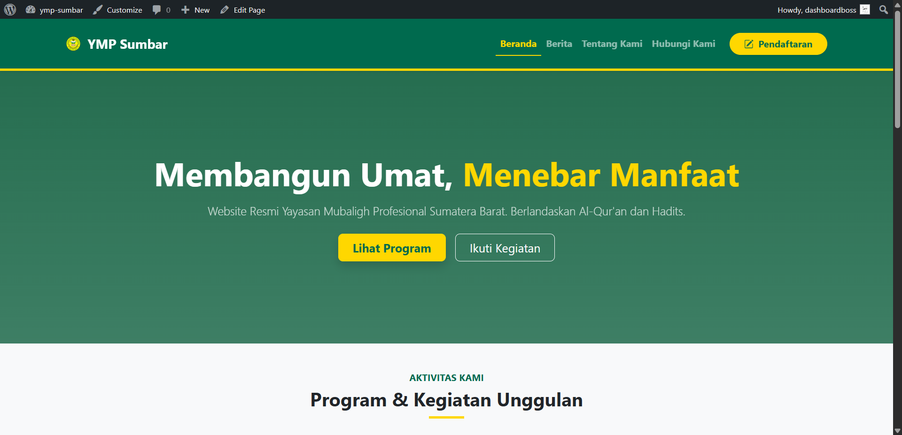

<div align="center">
  
  
  <br>
  
  
  
  
  
</div>
<br>

<p align="center">
  Tema WordPress kustom (Custom Theme) yang dikembangkan khusus untuk <b>Yayasan Mubaligh Profesional Sumatera Barat (YMP Sumbar)</b>.<br>
  Dibangun dengan pendekatan <i>clean code</i>, terintegrasi penuh dengan Bootstrap 5, dan manajemen konten dinamis via ACF.
</p>

---

## 📸 Demo Preview

<div align="center">
  
</div>

<br>

## 🚀 Fitur Unggulan

* ✨ **Desain Responsif & Modern:** Tampilan optimal di semua device menggunakan **Bootstrap 5**.
* 📝 **Dynamic Content Management:** Semua teks, gambar, dan link (Hero, Program, Galeri) dapat diedit via Admin Panel (ACF).
* 📰 **Sistem Portal Berita:** Layout arsip berita grid dan *Single Post* yang rapi & *readable*.
* 📲 **Smart WhatsApp Link:** Fitur `preg_replace` otomatis yang membersihkan nomor HP admin, memastikan link WA selalu valid.
* 🖼️ **Galeri Interaktif:** Pop-up modal Bootstrap untuk detail program dan dokumentasi foto.

## 🛠️ Tech Stack

| Komponen | Teknologi |
| :--- | :--- |
| **CMS Core** | WordPress |
| **Frontend** | HTML5, CSS3, Bootstrap 5.3 |
| **Backend** | PHP Native (WordPress Codex) |
| **Database** | MySQL |
| **Plugins** | Advanced Custom Fields (ACF) |

## 📂 Struktur Direktori

```text
ymp-sumbar-theme/
├── assets/
│   ├── css/          # Custom Styles (style.css, index.css, artikel.css)
│   └── images/       # Static Assets
├── footer.php        # Component: Footer
├── front-page.php    # Page: Halaman Utama (Landing Page)
├── functions.php     # Core: Theme Logic & Enqueue Scripts
├── header.php        # Component: Navbar & Header
├── index.php         # Page: Arsip Berita
├── page-*.php        # Page: Template Halaman Khusus
├── single.php        # Page: Detail Artikel Berita
└── style.css         # Metadata Tema